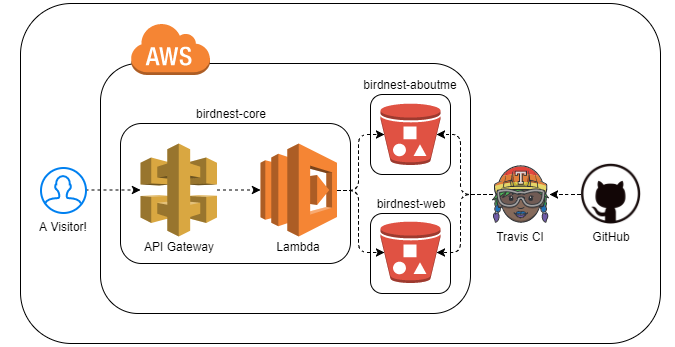

Personal Projects
=================

.. _BIRD FACTS:

BIRD FACTS
----------

BIRD FACTS is a Twitter bot (`@birdfaks <https://twitter.com/birdfaks>`_) I built
that shares TRUE BIRD FACTS ABOUT BIRDS. (not really true) Under the hood, it is
powered by AWS Lambda, Python and Wikipedia. The source is on
`GitHub <https://github.com/tay-bird/birdfacts>`_.

.. _clouds.js:

clouds.js
---------

clouds.js generates unique cloudscapes for `taybird.com <https://taybird.com/>`_.
I'm not a confident visual designer, so I challenged myself to create a novel
background for my website without any image assets. The resulting page consists
entirely of custom fonts and canvas/div shading. The source can be found on
`GitHub <https://github.com/tay-bird/birdnest-web/blob/master/birdnest/js/clouds.js>`_.

.. _Birdnest:

Birdnest
--------

Birdnest is my current web presense at `taybird.com <https://taybird.com>`_.
This project consists of:

* **birdnest-core** is an S3 router written in `Flask <https://github.com/tay-bird/birdnest>`_.
  It is served by AWS Lambda and API Gateway.
* **birdnest-web** is my static html splash page. It is deployed to S3 by
  `Travis CI <https://travis-ci.org/tay-bird/birdnest-web>`_.
* **birdnest-aboutme** (the page you're currently viewing) is generated from restructured
  text with Sphinx on `Travis CI <https://travis-ci.org/tay-bird/birdnest-aboutme>`_.
* **birdnest-posts** is a `journal <https://posts.taybird.com>`_ I built with Flask and
  DynamoDB. It is all about birds I have seen!

   Birdnest architecture.

.. _Skybird:

Skybird
-------

Skybird was a simple web portal for personal servers. It provided an 
email and calendar interface, local file management, and server stats dashboards.

I worked on this project in late 2014 to try my hand web development and hosting,
database administration, and user authentication with OAuth. The source code is
available on `Github <https://github.com/tay-bird/skybird>`_.

.. _Hotswappy:

Hotswappy
---------

Hotswappy is a proof-of-concept I put together over a weekend in Spring 2016. It
provides a plugin manager that allows a running service to reload Python modules
from source. It can be found on `Github <https://github.com/tay-bird/hotswappy>`_.
Documentation is available on `Github Pages <https://tay-bird.github.io/hotswappy/>`_.
