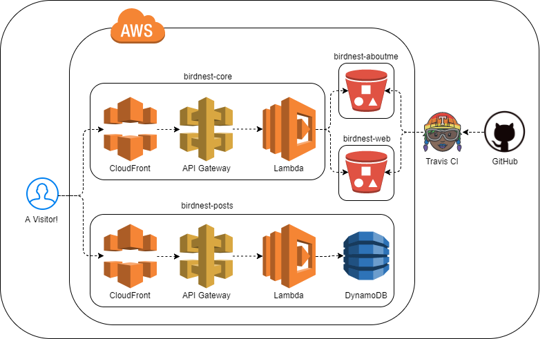

Projects
========

Personal Projects
-----------------

.. _BIRD FACTS:

### BIRD FACTS

BIRD FACTS is a Twitter bot (`@birdfaks <https://twitter.com/birdfaks>`_) I built
that shares TRUE BIRD FACTS ABOUT BIRDS. (not really true) Under the hood, it is
powered by AWS Lambda, Python and Wikipedia. The source is on
`GitHub <https://github.com/tay-bird/birdfacts>`_.

.. _clouds.js:

### clouds.js

clouds.js generates unique cloudscapes for `taybird.com <https://taybird.com/>`_.
I'm not a confident visual designer, so I challenged myself to create a novel
background for my website without any image assets. The resulting page consists
entirely of custom fonts and canvas/div shading. The source can be found on
`GitHub <https://github.com/tay-bird/birdnest-web/blob/master/birdnest/js/clouds.js>`_.

.. _Birdnest:

### Birdnest

Birdnest is my current web presense at `taybird.com <https://taybird.com>`_.
This project consists of:

* **birdnest-core** is an S3 router written in `Flask <https://github.com/tay-bird/birdnest>`_.
  It is served by AWS Lambda and API Gateway.
* **birdnest-web** is my static html splash page. It is deployed to S3 by
  `Travis CI <https://travis-ci.org/tay-bird/birdnest-web>`_.
* **birdnest-aboutme** (the page you're currently viewing) is generated from restructured
  text with Sphinx on `Travis CI <https://travis-ci.org/tay-bird/birdnest-aboutme>`_.
* **birdnest-posts** is a `journal <https://posts.taybird.com>`_ I built with Flask and
  DynamoDB. It is all about birds I have seen!

   Birdnest architecture.

.. _Skybird:

### Skybird

Skybird was a simple web portal for personal servers. It provided an 
email and calendar interface, local file management, and server stats dashboards.

I worked on this project in late 2014 to try my hand web development and hosting,
database administration, and user authentication with OAuth. The source code is
available on `Github <https://github.com/tay-bird/skybird>`_.

.. _Hotswappy:

### Hotswappy

Hotswappy is a proof-of-concept I put together over a weekend in Spring 2016. It
provides a plugin manager that allows a running service to reload Python modules
from source. It can be found on `Github <https://github.com/tay-bird/hotswappy>`_.
Documentation is available on `Github Pages <https://tay-bird.github.io/hotswappy/>`_.

Employer Projects
-----------------

.. _Tool Garden:

### Tool Garden

Tool Garden was an internal Python library at Stytch that supplemented Boto to
deploy new applications and infrastructure. I worked on this project along with
two other engineers at Stytch.

Tool Garden was not a remarkable project. However, it was still a valuable
experience for me. This was my first full-time software development
project and my first time doing a major collaboration with another engineer.
Additionally, it forced me to learn many new tools and processes: automated
tests, staged deployments, api doc generation, and dependency management.

.. _Neversleep:

### Neversleep

Neversleep was a ChatOps platform I developed at Demonware. It provided a dynamic
framework for developing plugins that could interact with end users over Jabber.

I developed Neversleep as an onboarding project shortly after I joined Demonware
and continued to improve it throughout my time there. By the time I left, the core
framework had matured into a robust, reliable, and well used internal ChatOps service.

.. _Jarvis:

### Jarvis

Jarvis was a monitoring framework used at Demonware for data aggregation and analysis.
It watched for certain events or event patterns and generated email reports
in response.

I produced this service with another engineer in the NOC department to provide other
teams with a framework for gathering, analyzing, and responding to a wide range
of system metrics.

